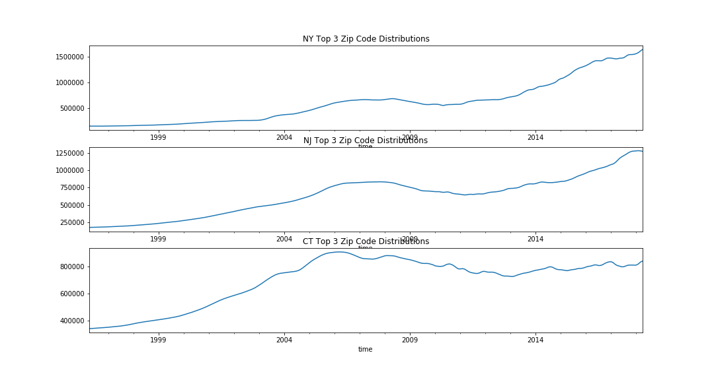
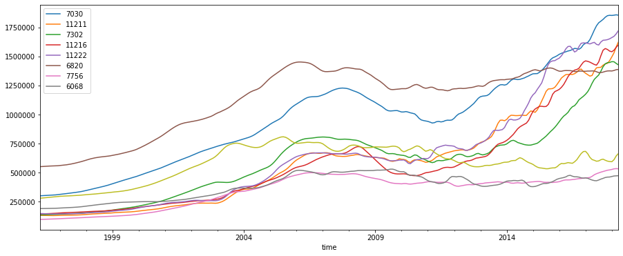
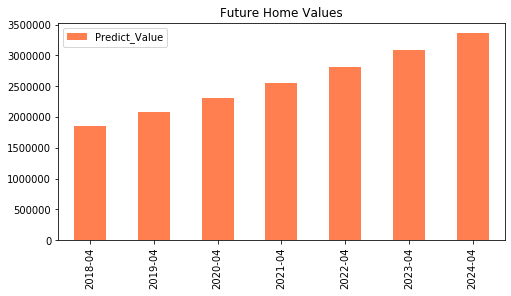
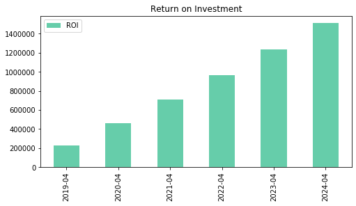
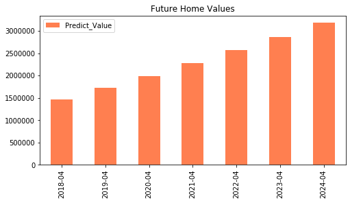
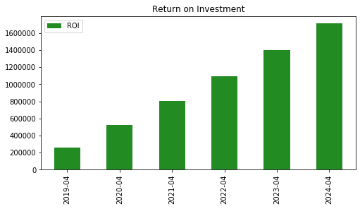

# Tri-State Glory
Emilia Orellana & Maura Cerow

data: https://www.zillow.com/research/data/

## Introduction
For this project, we looked at zillow housing values from 1996 to 2018. We chose to focus on the top zip codes from the tri-state area. To determine the 'best' zip code, we looked at the return on investment from each area from 1996 to 2018. We excluded the areas where there were no observations from 1996 to 2004.

The goal of this project is not only to tell someone where to buy, but also forecast how much they should expect to pay at a given time. If someone is interested in buying in Hoboken in April 2024, we can give an estimate based on our best model for how much a home will cost on average.

The libraries used in this project includes:
    - Pandas
    - NumPy
    - Matplotlib
    - Statsmodels
    - Sklearn
 
In this repo, you will find our jupyter notebooks, image folder, and csv files used in our analysis.

## Data Preprocessing & Zip Code Selection:

    see: 'Data_Processing_and_Zip_Code_Selection.ipynb'
    
To begin, we first had to settle on the zip codes we would be using. We loaded in a csv file for the Zillow data from 1996 to 2018. We added the ROI column which became our measure for "best" zip code. At first we saw that the top 5 were mostly in Brooklyn with Jersey City creeping into the top 5. To offer some more variety, we decided to look at the top 3 zip codes in each state. We ultimately will investigate:

  New York:
  
    11211 Williamsburg
    11222 Greenpoint
    11216 Bedford Stuyvesant
    
  New Jersey:
  
    07302 Jersey City
    07030 Hoboken
    07756 Ocean Grove
    
  Connecticut:
  
    06820 Darien
    06068 Salisbury
    06793 Washington
    
## Melting Data and Preliminary EDA

    see: 'Melting_Data_into_Long_Time_Series.ipynb'
    
The Zillow data originally came in as in wide format. For our analysis we need it to be in long format. Using our trimmed down dataframe for just the 9 zip codes we're interested in, we looked at the distribution by each state for the average value. This value ties back to the three zip codes, not the total state.

We're really interested in the zip codes individually. We looked at the distro's in this notebook together but will further investigate them in the individual state notebooks.

This notebook is a first pass at looking for stationarity. We looked at the descriptive statistics along with the visualization of the distribtions. So far it looks like stationarity is not present. We'll confirm in our next notebooks using the Dickey-Fuller tests.

## New York Stationarity Tests & Modeling

    see: 'NY.ipynb'
    
The top 3 zip codes in New York in which had the highest return on investment were 11211, 11222,11216 which are all located in Brooklyn. The neighborhoods are Williamsburg, Greenpoint, and Bedford. For each zip code the steps were fairly similar as having to identify stationarity using the Dickey-Fuller test and differencing until the data was stationary. For each zip code we had to difference twice to reach stationarity. The findings indicate the neighborhood Greenpoint zip code 11222, will give a home owner the highest return on investment in the year 2024. Although the values of the home seem to be higher in this neighborhood than others, the return on investment is also the highest! 

### Greenpoint Forecasted Values:

 

Once we got to stationary results, we were able to look at our ACF and PACF graphs. We then passed the ARIMA model through 24 possible order combinations. We evaluated the model and determined the best one by looking at the AIC and RMSE values. We wanted to make sure our model was close to capturing the actual values so customers are better prepared with what they'll likely spend when they're ready to buy.

Our last step was to forecast through 2024 and calculate the return on investement we expect if we sold in 2018 based on those forecasted future values.

## New Jersey Stationarity Tests & Modeling

    see: 'New_Jersey_Final.ipynb'
    
The top 3 zip codes for New Jersey we looks at are 07302 Jersey City, 07030 Hoboken, 07756 Ocean Grove. Jersey City and Hoboken both have values upwards of $1 million. Ocean Grove is a shore town where the average value was below $500k for most of the time period we were looking at. While Hoboken boasts the highest values overall, Jersey City actually has the highest ROI. It's almost a steal, if a cool $1.8 million is a steal.

 

We modeled our New Jersey zip codes the same. We looked at both AIC and RMSE and picked the most accurate model by minimizing RMSE. Interstingly, our Ocean Grove model undervalued the future forecasts of home values. One reason we suspect this is that our test data, the most recent data, picked up significantly to where our training data had left off. The area saw a rise in value the deviated from the training data and our model wasn't able to see it. We'd like to further investigate Ocean Grove specifically to see if we can better predict values here. Both Jersey City & Hoboken predict the continued uptick in value that actualized from 2015-2018.

## Connecticut Stationarity Tests & Modeling

    see: 'Connecticut_Final.ipynb'
    
For Connecticut, we looked at 06820 Darien, 06068 Salisbury and 06793 Washington. The Connecticut areas we looked at were more modestly priced compared to New York and New Jersey. Darien, a nearby town to Stamford is the highest valued, peaking at $1.2m. Salisbury, a town along the border of Massachusetts and New York, was valued ultimately around $500k and Washington, another New York border town was valued at around $700k by April 2018. 

Our modeling practice the same here, we noticed that Darien seems to have plateaued in recent years. It was the biggest ROI in the state based on the 22 years of data we had, but it doesn't seem to be gaining that same ground. Our model was able to closely predict values, but when looking at these values, they slowly start to decline. While Darien declines, both Salisbury and Washington increased in our forecast. Our Salisbury model looks to closely predict to our actuals, but like Ocean Grove, NJ, Washington is currently being undervalued. There's definitely room for improvement by playing with the parameters we pass through the ARIMA model.

## Conclusions and Future Steps

This project aims to determine the best markets to buy in to see a return on your investment based on previous home values. With this, we can actually predict the prices in the future so if you're planning on buying in Hoboken in 2022, you can expect to pay around $2.6m. This will help a family plan in terms of saving and set expecations around the home buying process.

To further this project it would be interesting to view the results for zip codes in the West coast. In addition, from the findings on the Tri-state area gentrification seems play a big role on the values of homes. The next step would be to take into account recent information of the area and see how they influence on value. To expand our knowledge it would be ideal to also investigate apartments. The value of Manhattan apartments keep going up, but for how long? Which area of Manhattan might be the best to invest if one was a millionaire? 

## Presentation

[tri-state glory](https://docs.google.com/presentation/d/1RzUf3kiLXO2lBr-BoeM99jxh9UVLWxkVEcy3sngw0F0/edit?ts=5eb45794#slide=id.g776ddd4110_0_10)
